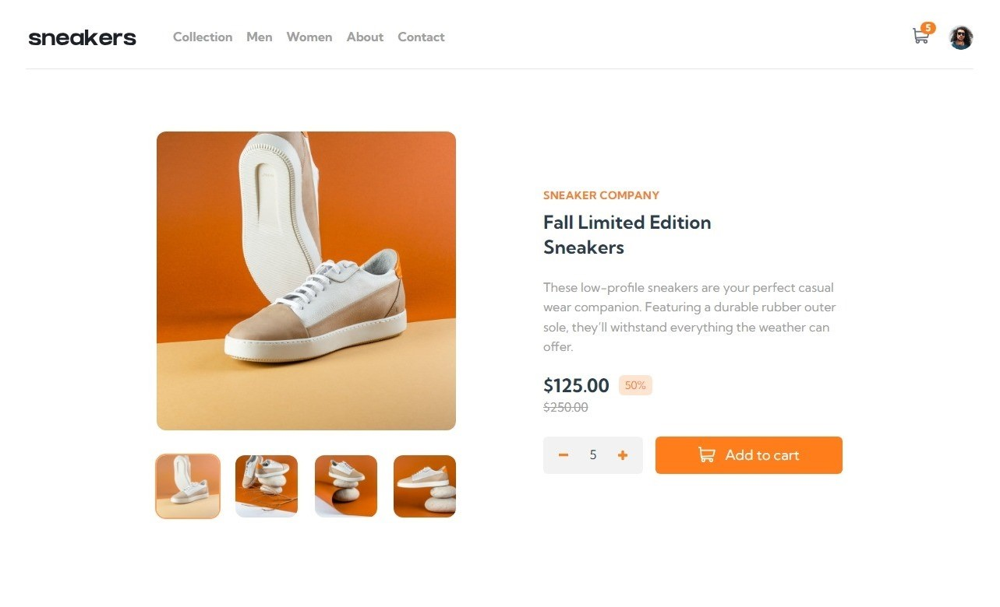
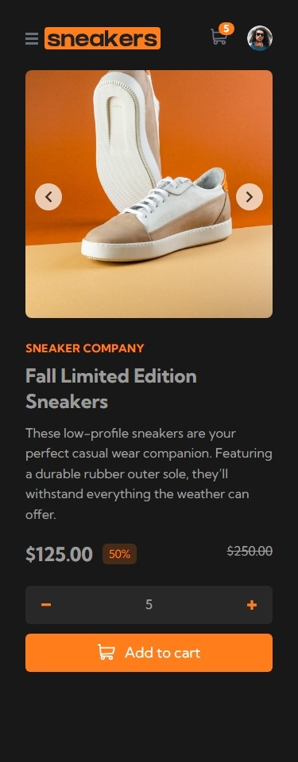

# E-commerce Product Page

This is a beautifully crafted E-commerce Product Page with dynamic theming.

Live Site: [E-commerce Product Page](https://sushcod3.github.io/ecommerce-product-page/)

## Table of contents

- [Features](#features)
- [Screenshot](#screenshot)
- [Technologies Used](#technologies-used)
- [Lessons Learned](#lessons-learned)
- [Acknowledgments](#acknowledgments)

### Features

- Open a lightbox gallery by clicking on the large product image
- Switch the large product image by clicking on the small thumbnail images
- Add items to the cart
- View the cart and remove items from it
- Dynamic Theme
- View the optimal layout for the site depending on their device's screen size

### Screenshot

### Technologies Used

- Vue.js
- Tailwind CSS

### Lessons Learned

1. **Efficient Lightbox Gallery Implementation**:
   Mastered the creation of a lightbox gallery with seamless dynamic switching for thumbnails.

2. **Advanced CSS Techniques for Image Centering**:
   Utilized top-2/4 transform and translate-y-1/2 to effectively center items inside images.

3. **Component Communication Optimization with defineProps and Emits**:
   Successfully implemented defineProps() and defineEmits() in Vue.js to enhance component communication. First defined custom events using defineEmits(['addCart']). It emits the 'addCart' event with the necessary data inside an event function. Next listened to the custom event on the parent component and handled the emitted data. Finally defined a new const to store the received data and updated the component accordingly.

4. **Leveraging Vue Slots for Modular Design**:
   Utilized Vue's slots component to seamlessly integrate parent content into child components.

5. **Dynamic Theming with :root Theme Colors**:
   Utilized :root theme colors for the project, enabling the easy creation of dynamic themes.

### Acknowledgments

This project is a solution to the challenges provided by [Frontend Mentor](https://www.frontendmentor.io/solutions/ecommerce-product-page-tailwind-css-vuejs-E_EYltYZfi), with some additional features implemented by me.
